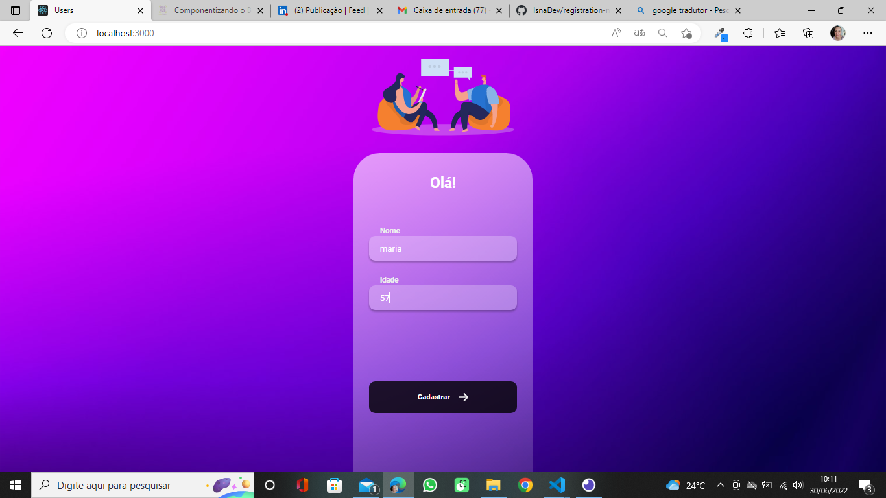

# Registration-name-age
 
Project done during react module classes in DevClub.

 
 

> Project created using HTML, CSS, JavaScript and React technologies. It is an application that on one screen registers the name of users and their ages and on another screen shows the list of registered users.

## 🤝👩🏻 Collaborator

<table>
  <tr>
    <td align="center">
      <a href="#">
         
        
          <b>Isnaíra Souza</b>
        
      </a>
    </td>
    
</table>
